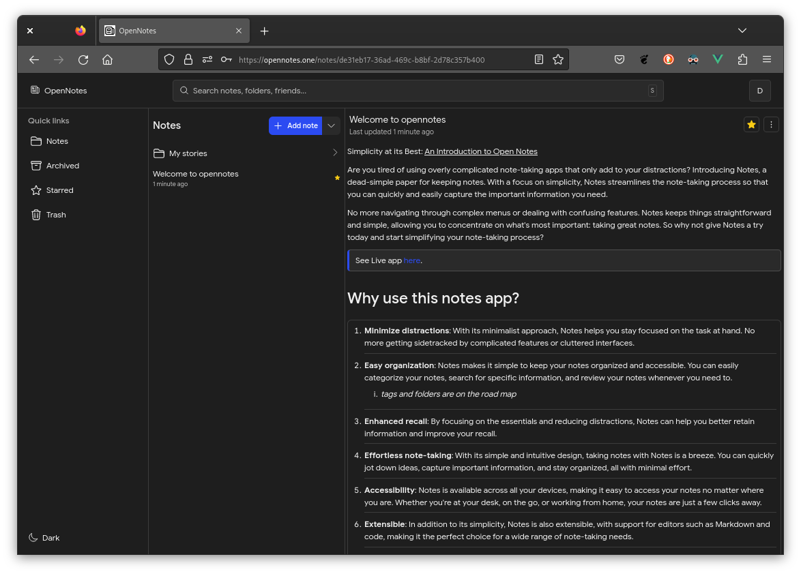

# Notes
### A dead-simple paper for keeping notes.

Notes is a simple notes taking app that focuses on simplicity to reduce distractions.

> See Live app [here](https://note-box.netlify.app/).

[](https://github.com/acekyd/made-in-nigeria)



### Notes?

- Simple and easy to use
- Extensible with editors (such as Markdown and Code)
- Open-source
- Distraction free and minimal ui

### Local Setup

This repo contains the core code used in the web app. to get started you'd need [Yarn](https://yarnpkg.com/getting-started/install), [NodeJs](https://nodejs.org/) & [Git](https://git-scm.com/) Installed

**Instructions:**
- Clone project
```shell
$ git clone https://github.com/rubbieKelvin/notes.git // or 'git@github.com:rubbieKelvin/notes.git' for ssh
$ yarn // install packages
$ yarn dev // run locally
```

> open your browser to `http://localhost:3000`.

## Contributing

For contributing, There're probably tons of [issues](https://github.com/rubbieKelvin/notes/issues) opened right now, Self assign your self to a project, fork this repository, push updates/changes to your fork and make a PR.
